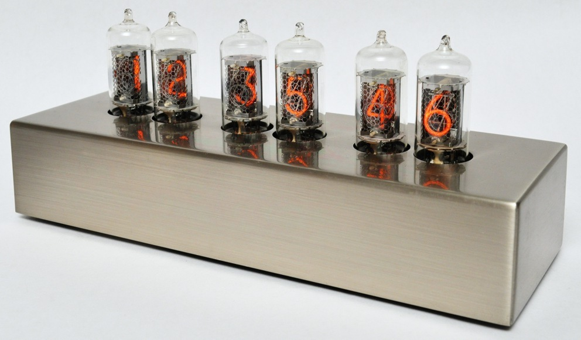

The Karlsson Nixie clock (by Peter van der Jagt 1997) is very stylish. One of the first of the kind and definitely setting the trend. Unfortunately it does not hold the time after a power outage. For quite some time I was thinking of adding a time synchronization module.

See more at [Onno's Elecronics](https://www.glowbug.nl/neon/KarlssonClock.html).

Initially the idea was to use the long wave radio receiving the [DCF77](https://en.wikipedia.org/wiki/DCF77) signal. DCF77 is increasingly more problematic as the 77kHz frequency is impacted by the totality of high frequency digital power supplies that generate lots of radio noise.

The alternative is of course fully digital, relying on an Internet time source, based on the NTP protocol. Surprisingly (or not) the NTP-based module has proven to be super easy to build these days (...with the help of AI).

The basic idea is this:
- At power cycle / reboot the clock starts with 00:00:00
- You advance the hours by clicking a momentary switch
- You advance the minutes by clicking another momentary switch. Advancing minutes resets seconds to :00
- So make a small WiFi module that connects to the Internet, gets the current time from a trusted NTP time server and generates the needed switch clicks to set the time.

Some additional design details:
- I decided to use the [Seeed Studio XIAO C3](https://www.seeedstudio.com/XIAO-ESP32S3-p-5627.html) module. Very compact form factor, external WiFi antenna (the clock has thick metal enclosure), support for Arduino IDE with very simple USB-C power/programming/debug connector.
- Setup is by starting a WiFi AP on the XIAO and having all parameters on the captive portal page. This technique buys a very good UX, as basically you connect to the WiFi network and the setup page pops up automatically.
- Initially I wanted to interface to the clock via small relays (the safest option), but after some examinations of the circuit I ended up with simple MOSFET transistors.
- Claude spotted the MC33064 reset supervisor chip on one of the photos and suggested interfacing with it: sending the reset pulse and also receiving detecting a brownout condition when the clock was reset and the XIAO module would not necessarily detect this.
- Daylight Saving Time (DST) is also handled by advancing hours by +1 or +23 twice a year.

The whole project was done with Claude AI. Besides the above design requirements I did not do much else. In particular I have NOT seen / touched the code. We (Claude and I) went through a couple of iterations that included adding support for WPA2-Enterprise (PEAP / MSCHAPv2) and improving debouncing of the reset switch. The code is 100% written by Claude.

About 1000 lines in total with the key blocks:
- Setting up a WiFi AP with a captive portal page
- Switching WiFi from AP to Client mode and associating with the infrastructure AP, including WPA2-Enterprise
- Getting and IP address via DHCP
- Getting the time via NTP
- Calculating the exact time required to "pulse" the clock
- Pulsing the clock MCU inputs to advance the required number of hours / minutes
- Hosting the html status page
- Watching for DST changes and potential resets

For details see: 
- [The Arduino source code](NixieSync.ino)
- [The Claude design blueprint](NixieSync.md)
- [The PDF PCB layout](NixieSyncLayout.pdf)
